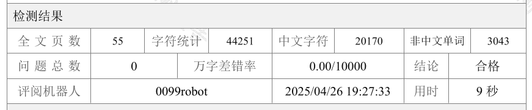

# 北京邮电大学本科学士学位论文模板

> 本仓库中的部分内容来自[BYRIO/BUPTBachelorThesis](https://github.com/BYRIO/BUPTBachelorThesis)，在此对前辈的工作表示感谢。

## 内容

本仓库为按照《北京邮电大学2025届本科毕业设计（论文）指导手册》制作的毕业设计及其文档的Latex模板，但不保证完全符合指导手册的要求和同学校提供的模板完全一致。

> 本README并非LaTeX的使用教程，我们默认您对于LaTeX有着基础的了解并懂得如何使用搜索引擎。

### 毕业论文

使用`main.tex`文件编译得到，按照“封面→诚信声明、关于论文使用授权的说明（一页）→中文摘要（含关键词）→外文摘要（含关键词）→目录→正文→参考文献→致谢→附录”的顺序编译为PDF文件输出。

其中封面和诚信申明、关于论文使用授权的说明之内容需要使用Word模板填写导出之后，分别命名为`cover.pdf`和`statement.pdf`文件放在`docs`文件夹下，否则论文的编译会失败。

论文的中文题目和英文题目在`main.tex`开头定义，请自行修改。

为提高编译的速度和提升编写时的体验，论文中的摘要、各个章节和附录使用`subfiles`宏包分布在各个子`tex`文件中：

- `chapters/abstract.tex`文件为论文的摘要页。
- `chapters/chapter1.tex`文件为论文的第一章。
- `chapters/chapter2.tex`文件为论文的第二章，以此类推。
- `appendix/appendix1.tex`文件为论文的附录一，以此类推。

上述文件使用

```latex
\subfile{chapters/chapter1}
```

的格式加入到`main.tex`文件中，如需增加新的章节和附录请一并修改。

### 开题报告

使用`Proposal/main.tex`文件编译得到，由于原始模板的要求，本文件的主体内容均写在一个超长表格之中，因此**跨页的时候需要自行增加表格**，带来使用上的不便，请**酌情使用**。使用之前请阅读`tabularray`宏包的[官方文档](http://mirrors.ctan.org/macros/latex/contrib/tabularray/tabularray.pdf)和相关教程。

由于在表格中的原因，主题内容中的每个单元格的`section`和`subsection`编号均需要手动使用`\setcounter`控制，请注意。

## 使用方式

### 本地

已通过`.latexmk`文件说明编译方式，本地安装`Tex Live`和`latexmk`之后可以使用

```shell
latexmk main.tex
```

编译论文的主体，

```shell
cd Proposal
latexmk main.tex
```

编译开题报告。

### Overleaf

撰写论文上传主文件夹下除`Proposal`以外的内容即可，使用`XeLaTeX`进行编译。

撰写开题报告上传`Proposal`文件夹的内容即可，使用`XeLaTeX`进行编译器。

## Q&A

### 为什么要使用LaTeX？

1. 本仓库无意比较LaTeX和Word作为排版软件之间的差距~~叠甲，过~~。
2. 我只会用LaTeX。
3. Overleaf的多人协作功能非常好用。

### 封面页和诚信申明页从哪里来的？

从学校提供的官方Word模板中编辑好导出为PDF文件，因为这两个文件使用Latex排版非常复杂，排版的效果也不好。

### 发现仓库更新了怎么办？

为了方便模板的使用，我一般情况下只会更新`BUPTBachlorThesis.sty`文件和`BUPTBachlor.bst`文件，前者管理整个文档的样式，后者负责生成参考文件的引用格式，直接将这两个文件整体复制替换即可。

### 这个模板能通过论无忧的格式检测吗？

能。有关问题和详情见[issue#8](https://github.com/jackfiled/BUPTBachelorThesis/issues/8)。



### 如何排版多张子图？

模板中提供了`subcaption`包作为子图排版的工具。一个示例如下：

```latex
\begin{figure}[htbp]
    \centering
    \begin{subfigure}{0.45\linewidth}
        \includegraphics[width=0.9\linewidth]{assets/coala-example-cpu.png}
        \subcaption{任务均运行在CPU上}
        \label{fig:coala-example-cpu}
    \end{subfigure}
    \hfill
    \begin{subfigure}{0.45\linewidth}
        \includegraphics[width=0.9\linewidth]{assets/coala-example-gpu.png}
        \subcaption{任务均运行在GPU上}
        \label{fig:coala-example-gpu}
    \end{subfigure}
    
    \begin{subfigure}{0.9\linewidth}
        \centering
        \includegraphics[width=0.6\linewidth]{assets/coala-example-hybrid.png}
        \subcaption{最优的调度方案}
        \label{fig:coala-example-hybrid}
    \end{subfigure}
    \caption{任务调度对于任务完成时间的影响示意图}
    \label{fig:coala-example}
\end{figure}
```

### ref.bib中的引用条目从哪里来的？

1. 建议使用Zotero等文献管理工具自动生成。
2. Google Scholar和各大文献出版机构一般也提供bibtex选项的引用格式生成。

### 为什么参考文献中英文文献出现了中文的“见”字，而不是In？

这是因为现在的`见`/`In`判断逻辑非常粗糙，是通过引用条目中是否存在`language`字段来判断的，所以文献文件`ref.bib`中的引用条目添加任意取值的`language`字段都会生成为`见`，因此引用英文文献就只能手动删除`language`字段以生成为`In`。

### 如何引用附录

在附录中使用指令`\appendixsection{}{}`创建标题，第一个参数是附录标题，第二个参数是引用label。在引用时使用指令`\hyperlink{}{}`，第一个参数是引用label，第二个参数是引用显示文本。举个栗子：

```latex
appendix1.tex中：
\appendixsection{附录1\quad 缩略语表}{appendix:abbr}

chapter2.tex中：
评论量含义见\hyperlink{appendix:abbr}{附录1\quad 缩略语表}
```

### 如何统计字数

见[issue#5](https://github.com/jackfiled/BUPTBachelorThesis/issues/5#issue-2992316613)

### 需要排版跨页的表格使用什么环境？

使用`tabularray`包提供的`longtblr`环境，一个例子如下：

```latex
\begin{longtblr}[
    caption = {基本块构建器提供的接口},
    label = {tab:basicblock-builder-interface}
]{
    colspec = {|p{4cm}|X[2,l]|X[1,l]|X[2,l]|},
    rowhead = 1, % 重复表头
}
\hline
\textbf{接口名称} & \textbf{参数} & \textbf{返回值} & \textbf{接口功能说明} \\
\hline
% 这里是表格内容
\end{longtblr}
```

### 如何导入外文资料

见[issue#12](https://github.com/jackfiled/BUPTBachelorThesis/issues/12)
